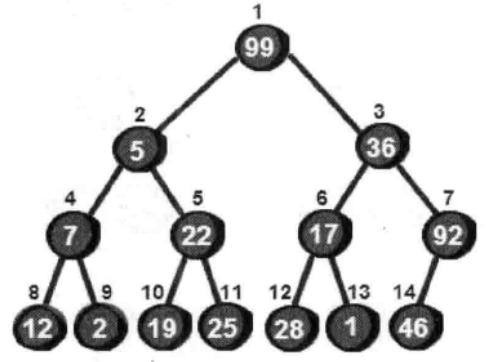
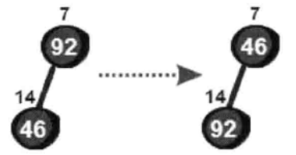
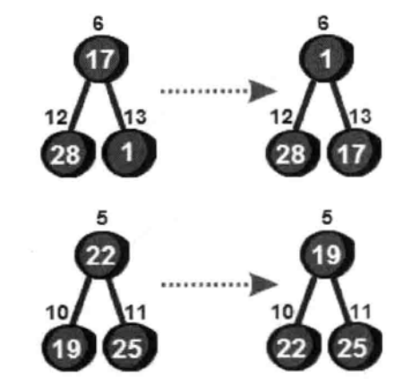
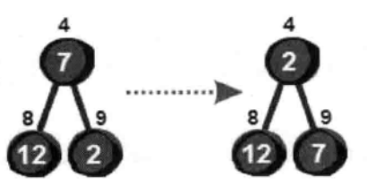
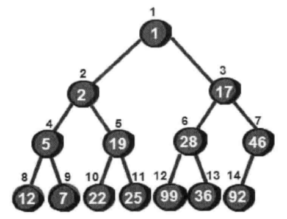

## 排序算法

### 冒泡排序 

```
原始序列 12 35 99 18 76
N = 5
从大到小降序排序

第 1 趟
35 12 99 18 76
35 99 12 18 76
35 99 18 12 76
35 99 18 76 12

第 2 趟
99 35 18 76 12
99 35 18 76 12
99 35 76 18 12

第 3 趟
99 35 76 18 12
99 76 35 18 12

第 4 趟
99 76 35 18 12

```

### 快速排序

```
原始序列 6 1 2 7 9 3 4 5 10 8
N = 10
从小到大升序排序

第 1 趟（j找到比6小的位置，i找到比6大的位置）
i                  j
6 1 2 7 9 3 4 5 10 8
^

      i       j
6 1 2 7 9 3 4 5 10 8
6 1 2 5 9 3 4 7 10 8
^
        i   j
6 1 2 5 9 3 4 7 10 8
6 1 2 5 4 3 9 7 10 8
^

         ij
6 1 2 5 4 3 9 7 10 8
3 1 2 5 4 6 9 7 10 8
          ^

递归两个子序列
3 1 2 5 4
9 7 10 8
```

### 简单插入排序

```
原始序列 99 5 36 7 22 17 46 12
N = 8
从小到大升序排序

99 5 36 7 22 17 46 12
   ^
5 99 36 7 22 17 46 12
     ^
5 36 99 7 22 17 46 12
        ^
5 7 36 99 22 17 46 12
          ^
5 7 22 36 99 17 46 12
             ^
5 7 17 22 36 99 46 12
                ^
5 7 17 22 36 46 99 12
                   ^
5 7 12 17 22 36 46 99

```

### 希尔排序

```
原始序列 8 9 1 7 2 3 5 4 6 0
N = 10
从小到大升序排序

增量序列 [5 2 1]

增量为5，分为5组
下标：0 1 2 3 4 5 6 7 8 9
序列：8 9 1 7 2 3 5 4 6 0
分组：[8 3] [9 5] [1 4] [7 6] [2 0]
排序：[3 8] [5 9] [1 4] [6 7] [0 2]
合并：3 5 1 6 0 8 9 4 7 2

增量为2，分为2组
下标：0 1 2 3 4 5 6 7 8 9
序列：3 5 1 6 0 8 9 4 7 2
分组：[3 1 0 9 7] [5 6 8 4 2]
排序：[0 1 3 7 9] [2 4 5 6 8]
合并：0 2 1 4 3 5 7 6 9 8

增量为1，分为1组
下标：0 1 2 3 4 5 6 7 8 9
序列：0 2 1 4 3 5 7 6 9 8
分组：[0 2 1 4 3 5 7 6 9 8]
排序：[0 1 2 3 4 5 6 7 8 9]
合并：0 1 2 3 4 5 6 7 8 9

```

### 简单选择排序

```
原始序列 99 5 36 7 22 17 46 12
N = 8

99 5 36 7 22 17 46 12
^
后续最小：5，交换 99 和 5
5 99 36 7 22 17 46 12
  ^
后续最小：7，交换 99 和 7
5 7 36 99 22 17 46 12
    ^
后续最小：12，交换 36 和 12
5 7 12 99 22 17 46 36
       ^
后续最小：17，交换 99 和 17
5 7 12 17 22 99 46 36
          ^
后续最小：22，不需要交换
5 7 12 17 22 99 46 36
             ^
后续最小：36，交换 99 和 36
5 7 12 17 22 36 46 99
                ^
后续最小：46，不需要交换
5 7 12 17 22 36 46 99

```

### 堆排序

note：
* 堆结构和堆排序不是同一概念。
* 堆结构：最小堆、最大堆

最小堆：所有父节点都要比子节点小

最大堆：所有父节点都要比子节点大

```
99 5 36 7 22 17 92 12 2 19 25 28 1 46
```

将原始序列构建为完全二叉树，如下图所示：



从非叶子节点开始调整位置使之符合最小堆特性，调整 7、6、5、4 号节点的过程如下图所示：







调整 7、6、5、4 号节点的位置后的二叉树如下图所示：


调整 3 号节点的过程如下图所示：


同理调整 2 号节点，最后调整 1 号节点，最后整棵树都符合最小堆特性，如下图所示：



### 归并排序

```
原始序列 10 5 7 3 2 8
N = 6

初始分组：[10] [5] [7] [3] [2] [8]
使用队列第 1 次归并后的分组：[5 10] [3 7] [2 8]
使用队列第 2 次归并后的分组：[3 5 7 10] [2 8]
使用队列第 3 次归并后的分组：[2 3 5 7 8 10]
[3 5 7 10] 
[2 8]
=> []

[3 5 7 10] 
[8]
=> [2]

[5 7 10] 
[8]
=> [2 3]

[7 10] 
[8]
=> [2 3 5]

[10] 
[8]
=> [2 3 5 7]

[10] 
[]
=> [2 3 5 7 8]

[] 
[]
=> [2 3 5 7 8 10]

```

#### 二路归并


#### 多路归并排序


### 基数排序

```
原始序列 53 3 542 748 14 214 154 63 616
N = 9

53 3 542 748 14 214 154 63 616
全部补零增加到3位：
053 003 542 748 014 214 154 063 616

按照个位开始排序：
542 053 003 063 014 214 154 616 748

按照十位开始排序：
003 014 214 616 542 748 053 154 063

按照百位开始排序：
003 014 053 063 154 214 542 616 748

还原：
3 14 53 63 154 214 542 616 748

```


### 桶排序

```
原始序列 8 3 2 5 5
N = 5

大概确定原始序列的最大值：8
  0    0    0    0    0    0    0    0    0    0    0
a[0] a[1] a[2] a[3] a[4] a[5] a[6] a[7] a[8] a[9] a[10]

  0    0    1    1    0    2    0    0    1    0    0
a[0] a[1] a[2] a[3] a[4] a[5] a[6] a[7] a[8] a[9] a[10]

排序后的结果：
8 5 5 3 2
```