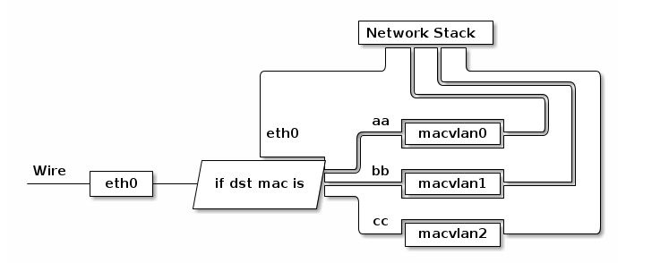

# macvlan


macvlan 是 Linux 操作系统内核提供的网络虚拟化方案之一，更准确的说法是网卡虚拟化方案。它可以为一张物理网卡设置多个 mac 地址，相当于物理网卡施展了影分身之术，由一个变多个，同时要求物理网卡打开**混杂模式**。针对每个mac地址，都可以设置IP地址，本来是一块物理网卡连接到交换机，现在是多块虚拟网卡连接到交换机。




```bash
ip link add link DEVICE name NAME type { macvlan | macvtap } mode { private | vepa | bridge | passthru [ nopromisc ] | source }

# enp0s8 是物理网卡
ip link add link enp0s8 mac1 type macvlan
ip link
23: mac1@enp0s8: <BROADCAST,MULTICAST> mtu 1500 qdisc noop state DOWN mode DEFAULT
    link/ether e2:80:1c:ba:59:9c brd ff:ff:ff:ff:ff:ff


ip netns add net1

ip link set mac1 netns net1
ip netns exec net1 ip link
23: mac1@if3: <BROADCAST,MULTICAST> mtu 1500 qdisc noop state DOWN mode DEFAULT
    link/ether e2:80:1c:ba:59:9c brd ff:ff:ff:ff:ff:ff

ip netns exec net1 ip link set mac1 name eth0
ip netns exec net1 ip link
23: eth0@if3: <BROADCAST,MULTICAST> mtu 1500 qdisc noop state DOWN mode DEFAULT
    link/ether e2:80:1c:ba:59:9c brd ff:ff:ff:ff:ff:ff

ip netns exec net1 ip addr add 192.168.8.120/24 dev eth0
ip netns exec net1 ip link set eth0 up

```

## 参考

* https://ctimbai.github.io/2019/04/01/tech/linux-macvlan/
* https://www.hi-linux.com/posts/40904.html
