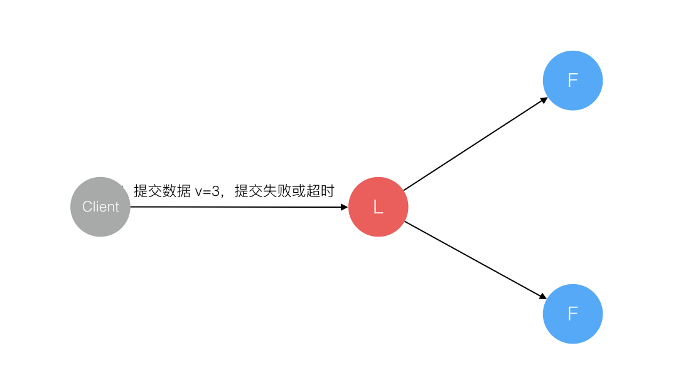
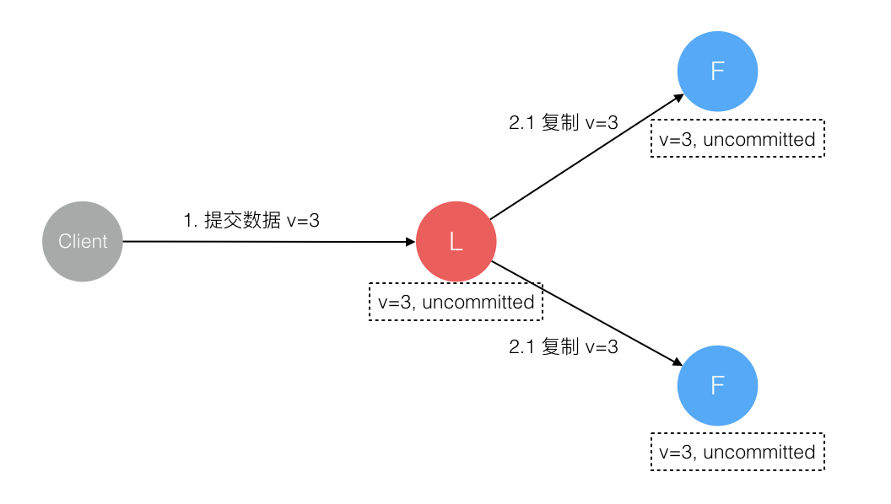
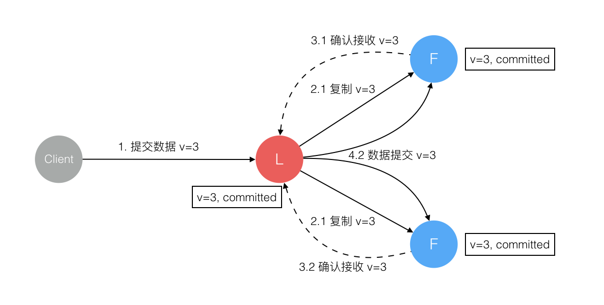

## 概述

根据 [CAP理论](https://github.com/donnemartin/system-design-primer#cap-theorem)，分布式系统都会存在不一致的问题。Raft 分布式协议就是解决这种不一致问题的方案之一。任何分布式系统都是为了对外提供服务，为了更好的对外提供服务，Raft 协议将集群中的节点分为不同的角色，不同的角色在对外提供服务的过程中有着不同的作用。因此，Raft协议就是说明了以下几个问题：

1. 实现Raft协议的系统中有哪些角色
2. 如何将集群中的节点分配不同的角色，也就是选举过程
3. 实现Raft协议的系统对外提供服务的过程，也就是不同的角色在系统中的作用
4. 当服务中断后如何恢复和保持一致性
5. 因为涉及到分配角色，也还需要说明触发选举过程的机制，还要说明哪些节点可以被选举


## Raft 角色和触发选举过程的机制
在一个实现 raft 协议的集群中有三种角色，如下图所示：


* Leader(领袖)
* Follower(群众)
* Candidate(候选人)

触发选举过程主要是以下三个原因：

1. starts up
集群开始时，此时所有的 Follower 都变成 Candidate，通过选举投票过程选出 Leader 后，Candidate 又全部变成 Follower，被选为 Leader 的节点开始自己的 Term。这时集群就可以正常对外提供服务。

2. times out starts election
Leader 需要定期向 Follower 发送心跳包，表明自己是存活的，如果 Follower 没有收到 Leader 的心跳包，在 `times out starts election` 时间后开始新的一轮选举，此时只有拥有最新数据的节点才可能被选为 Leader 节点，原来的 Leader 节点强制不能被选举成为 Leader。

3. times out / split votes new election
在一次选举的过程中，有可能没有那个节点能获得大多数选票，那么这次投票选举过程无效 `split votes`。之后每个节点随机休息一段时间（Election Timeout），之后重新发起投票直到某个节点获得多数票。在这种重新投票的机制中，最先从 Election Timeout 中恢复然后发起投票的节点向还在休息的节点请求投票，这时休息节点只能投给请求节点，很快完成投票过程。

note：
如果由于网络故障出现脑裂情况，这时在集群中就产生两个 Leader 节点。原先的 Leader 独自在一个分区，向它提交数据不可能复制到多数节点，所以永远提交不成功。后来选举出来的新 Leader 由于可以向大多数 Follower 节点复制数据，所有数据可以提交成功，并且新的 Leader 节点比旧的 Leader 节点拥有更高的 Term 数。网络恢复后旧的 Leader 节点发现集群中有比自己新的 Term 的 Leader 节点，所有旧的 Leader 节点自动降级为 Follower 节点， 并从新 Leader 节点处同步数据达成集群数据一致。


```
starts up
times out starts election
times out / split votes new election
receives votes from majority of servers
discovers server with higher term
discovers current leader or new term
term
```


## raft Leader 选举过程


## raft 对外提供服务的过程
Raft 协议强依赖 Leader 节点的可用性来确保集群数据的一致性。数据的流向只能从 Leader 节点向 Follower 节点转移。当 Client 向集群 Leader 节点提交数据后，Leader 节点接收到的数据处于未提交状态(`Uncommitted`)，接着 Leader 节点会`并发`向所有 Follower 节点`复制数据`并等待接收响应，`确保至少集群中超过半数节点已接收到数据`后再向 Client 确认数据已接收。一旦向 Client 发出数据接收 Ack 响应后，表明此时数据状态进入已提交(`Committed`)，Leader 节点再向 Follower 节点发通知告知该数据状态已提交。整个过程如下图所示：


1. Client 向集群 Leader 节点提交数据 `v=3`

2. Leader 节点接收数据，标记数据为未提交状态 `v=3 Uncommitted`

3. Leader 节点向所有 Follower 节点并发复制数据

4. Follower 节点接收数据，标记数据为未提交状态 `v=3 Uncommitted`

5. Follower 节点向 Leader 节点发送响应，确认数据已接收

6. Leader 节点接收到 Follower 节点的响应后，Leader 节点向 Client 发送响应，确认数据已接收并同步标记数据为提交状态 `v=3 committed`

7. Leader 节点向 Follower 节点发送通知告诉 Follower 节点数据为提交状态

8. Follower 节点接收通知后修改数据状态为提交状态 `v=3 committed`


## Leader 节点宕机后的处理过程

在对外提供服务的过程中，Leader 节点可能在任意阶段宕机，Raft 协议需要在服务中断后进行恢复并且保持数据的一致性。所谓恢复就是重新选举 Leader 节点，保持数据一致性就是选举新的 Leader 节点后所有的 Follower 节点要从新的 Leader 节点复制数据。为了确保新的 Leader 节点拥有集群中的最新数据，新的 Leader 节点只能从拥有最新数据的节点中选择。在不同阶段 Leader 节点宕机会产生不同的后果，恢复和保持数据一致性的方法也不一样，具体如下：

1. Client 向 Leader 节点提交数据，但提交失败或者超时，如下图所示

此时客户端的数据没有发送到 Leader，Leader 节点宕机对一致性没有影响

2. Client 向 Leader 节点提交数据，数据到达 Leader 节点，但 Leader 没有向 Follower 节点复制数据，如下图所示：

此时数据在 Leader 节点上处于为提交状态 `v=3 Uncommitted`。若 Leader 在这时宕机，数据处于未提交状态，Client 不会收到 Leader 的响应，Client 会认为提交失败或者超时，Client 可安全发起重试。
Follower 节点上没有该数据，也没有收到 Leader 节点的心跳包，整个系统会触发选举过程，重新选举 Leader 节点。选举成功新的Leader节点后，Client 会重试向系统提交数据，整个过程恢复正常。
原来的 Leader 节点恢复后作为 Follower 节点加入集群从新的 Leader 节点同步数据，强制保持和新 Leader 节点数据一致。(原来的 Leader 节点在新的选举过程中强制不能重新被选为 Leader 节点)
经过上述过程后系统恢复正常，数据也保持了一致性。

3. Client 向 Leader 节点提交数据，数据到达 Leader 节点，Leader 节点向`所有` Follower 节点复制数据，在Leader 节点没有接收到大多数 Follower 的响应之前 Leader 节点宕机，如下图所示：

此时数据在所有节点上都处于未提交状态 `v=3 Uncommitted`。重新选举出 Leader 节点后，在选举结束对外提供服务之前，所有的 Follower 节点向新的 Leader 节点发送响应，确认数据提交，数据在所有节点上都处于提交状态并保持一致性。
由于 Client 没有接受到系统的响应，Client 无法确认数据是否提交成功，因此 Client 可重新提交数据。针对这种情况，Raft 要求系统实现幂等性，也就是要实现内部去重机制。

4. Client 向 Leader 节点提交数据，数据到达 Leader 节点，Leader 节点向`部分` Follower 节点复制数据，在Leader 节点没有接收到大多数 Follower 的响应之前 Leader 节点宕机，如下图所示：

此时数据在 Follower 节点处于未提交状态 `v=3 Uncommitted` 并且部分 Follower 节点不存在该数据。Raft 协议要求投票只能投给拥有最新数据的节点。所以拥有最新数据的节点会被选为 Leader 再强制同步数据到 Follower，数据不会丢失并最终一致。

5. 数据到达 Leader 节点，成功复制到 Follower 所有或多数节点，Leader 节点接收到大多数 Follower 节点的响应，数据在 Leader 节点处于已提交状态`v=3 committed`，在 Leader 向 Follower 节点发送数据提交状态之前，Leader 节点宕机，如下图所示：

此时数据在某些 Follower 节点上处于提交状态，在某些节点上处于未提交状态。重新选举只会选举拥有最新数据的节点为 Leader。选举成功后强制同步数据，和3、4的过程类似。

6. 数据到达 Leader 节点，成功复制到 Follower 所有或多数节点，数据在所有节点都处于已提交状态，但还未响应 Client，如下图所示：

此时数据在集群内部处于一直状态，重新选举后对一致性没有影响。

7. 网络分区导致的脑裂情况，出现双 Leader 节点，如下图所示：

网络故障总是存在的，当由于网络原因导致 Leader 访问不到 Follower 时，Leader 由于不能将数据复制到大多数 Follower 节点，因此 Leader 也无法向 Client 发送接收响应。导致 Client 认为数据提交失败，系统处于不可用状态。另外，Follower 节点接收不到 Leader 节点的心跳包，Follower 节点在 `times out starts election` 时间后重新进行选举，这是系统中实际是有两个节点是 Leader 角色。
新选举出来的 Leader 节点此时可以响应 Client 的请求。系统在 Client 看来是可用的。当网络故障排除或者消失后，原来的 Leader 节点重新加入集群，此时需要比较两个 Leader 节点的任期`Term`，拥有最新的`Term`的 Leader 节点继续充当 Leader 节点。一般来说后期选举出来的 Leader 节点拥有最新的`Term`。其他的 Leader 节点降级为 Follower 节点并从最新的 Leader 节点同步数据。最后数据保持了一致性。

* [参考1](http://thesecretlivesofdata.com/raft/)
* [参考2](https://raft.github.io/)
* [参考3](https://www.cnblogs.com/mindwind/p/5231986.html)
