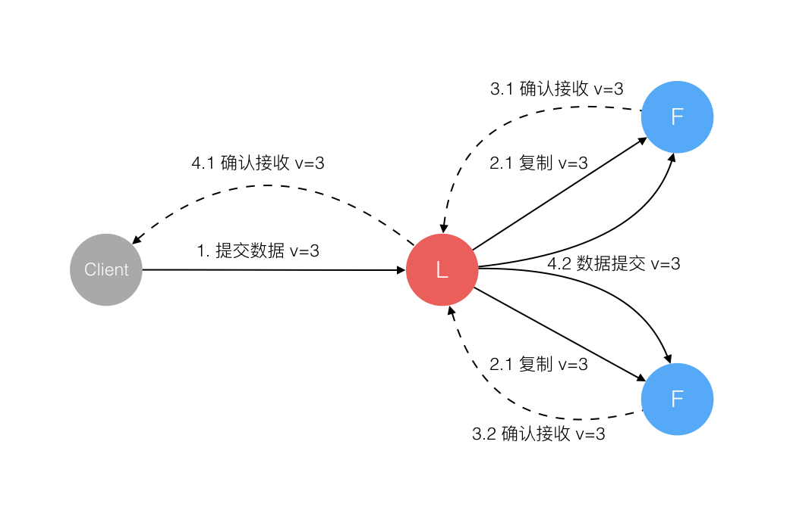

## Raft 协议总结

实现 Raft 协议的集群对外提供服务的过程如下图所示：

1. Client 向集群 Leader 节点提交数据 `v=3`

2. Leader 节点接收数据，标记数据为未提交状态 `v=3 Uncommitted`

3. Leader 节点向所有 Follower 节点并发复制数据

4. Follower 节点接收数据，标记数据为未提交状态 `v=3 Uncommitted`

5. Follower 节点向 Leader 节点发送响应，确认数据已接收

6. Leader 节点接收到 Follower 节点的响应后，Leader 节点向 Client 发送响应，确认数据已接收并`同步`标记数据为提交状态 `v=3 committed`

7. Leader 节点向 Follower 节点发送通知告诉 Follower 节点数据为提交状态

8. Follower 节点接收通知后修改数据状态为提交状态 `v=3 committed`

## 

那么 Raft 协议是如何实现 [CAP理论](https://github.com/donnemartin/system-design-primer#cap-theorem) 理论里的 `Consistency`、`Availability`、`Partition Tolerance`的呢？

* Consistency
	* 在正常情况下，Leader 节点通过向 Follower 节点复制数据并且要收到`大部分` Follower 节点的响应来保障一致性的要求
	* 当 Leader 节点出现问题后，选择拥有`最新数据`的节点成为新的 Leader 节点以此来保障数据的一致性

* Availability
	* Leader 节点要定期向 Follower 节点发送心跳包说明自己还存活着。
	* 当 Follower 节点一段时间没有收到 Leader 节点的心跳包后马上重新选举新的 Leader 节点

* Partition Tolerance
	* 每个 Leader 节点都有自己的任期`Term`，当出现多个 Leader 节点时，只要最新任期的 Leader 节点时合法的

## 

集群对外提供服务的过程中，若出现意外情况处理办法的详细说明：

1. Client 向集群 Leader 节点提交数据 `v=3`

    * 此时如果Leader节点无法提供服务，也就是Client向Leader发送数据不成功

    * 对于Client来说，Client要实现重试机制，也就是如果发送数据不成功要多次发送数据确保有一次数据能发送成功

    * 对于集群来说，此时集群中的任何节点都没有Client的数据，无论集群内部发送什么情况都不会对数据的一致性有影响

2. Leader 节点接收数据，标记数据为未提交状态 `v=3 Uncommitted`

    * 此时如果Leader节点出现问题无法正常运行

    * 对于Client来说，Client由于长时间没有收到Leader的响应，所以Client也要实现重试机制，在timeout后重新发送数据

    * 对于集群来说，此时集群中只要Leader节点拥有未提交的数据，其余的Follower节点都没有数据，当Follower节点重新选举出新的Leader节点后，Client重新发送数据，集群执行后续流程，原来的Leader节点恢复后向新的Leader节点同步数据，最终保障数据的一致性

3. Leader 节点向所有 Follower 节点并发复制数据

4. Follower 节点接收数据，标记数据为未提交状态 `v=3 Uncommitted`

5. Follower 节点向 Leader 节点发送响应，确认数据已接收

	* 由于集群中的所有流程都是多线程或者多进程加异步执行的，所以步骤3、步骤4、步骤5在Follower节点上不是同步执行的，每个Follower节点执行的进度不一样，所处的状态也不一样

	* 此时如果Leader节点出现问题无法正常运行

    * 对于Client来说，Client由于长时间没有收到Leader的响应，所以Client也要实现重试机制，在timeout后重新发送数据

    * 对于集群内部来说，Leader节点拥有未提交的数据，Follower节点由于不是同步执行，所以Follower节点的数据状态有多种情况，分别如下：

    	* 所以Follower节点都没有数据，因为Leader节点还没来得及向Follower节点复制数据

    	* 少部分Follower节点拥有未提交的数据，大部分节点没有数据

    	* 大部分Follower节点拥有未提交的数据，少部分没有数据

    	* 特别说明，此时不可能所以的Follower节点都拥有未提交的数据，因为系统在异步执行，当大多数节点向Leader节点发送响应后，Leader节点就开始改变数据状态

    * 无论Follower节点上的数据状态怎么样，新的Leader节点都只能从拥有最新数据的节点中产生，然后其余Follower节点执行后续流程，也就是向新的Leader节点发送响应。原来的Leader节点恢复后向新的Leader节点同步数据。

    * 此时新的Leader节点无法向Client发送响应，只能重新接收Client发送的数据，为了避免数据重复，集群要实现幂等性

6. Leader 节点接收到 Follower 节点的响应后，Leader 节点向 Client 发送响应，确认数据已接收并`同步`标记数据为提交状态 `v=3 committed`

	* 此时如果Leader节点出现问题无法正常运行

	* 对于Client来说，有可能收到Leader的响应，也有可能没有收到
		* 如果Client收到响应，Client认为数据提交完成，此时只要集群保持数据一致性即可

		* 如果Client没有收到Leader的响应，Client也要实现重试机制，在timeout后重新发送数据，集群重新对外提供服务后也要实现幂等性

	* 对于集群内部来说，Follower节点上的数据状态有两种情况

		* 大部分Follower节点拥有未提交的数据，少部分没有数据

		* 所有Follower节点都有未提交的数据，因为集群的异步多线程多进程执行导致Leader节点有可能还在继续向Follower节点复制数据

	* 无论Follower节点上的数据状态怎么样，新的Leader节点都只能从拥有最新数据的节点中产生，然后其余Follower节点执行后续流程，也就是向新的Leader节点发送响应。原来的Leader节点恢复后向新的Leader节点同步数据。

    * 此时新的Leader节点无法向Client发送响应，只能重新接收Client发送的数据，为了避免数据重复，集群要实现幂等性

7. Leader 节点向 Follower 节点发送通知告诉 Follower 节点数据为提交状态

8. Follower 节点接收通知后修改数据状态为提交状态 `v=3 committed`

	* 此时如果Leader节点出现问题无法正常运行

	* 对于Client来说，已经收到Leader的响应，Client认为数据提交完成，此时只要集群保持数据一致性即可

	* 对于集群内部来说，Follower节点上的数据状态有可能有如下几种情况

		* 有些节点上有未提交的数据

		* 有些节点上有已提交的数据

	* 无论Follower节点上的数据状态怎么样，新的Leader节点都只能从拥有最新数据的节点中产生(此时的最新数据有可能是已提交的数据)，然后其余Follower节点执行后续流程，也就是向新的Leader节点发送响应。原来的Leader节点恢复后向新的Leader节点同步数据。

    * 此时新的Leader节点无法向Client发送响应，只能重新接收Client发送的数据，为了避免数据重复，集群要实现幂等性

## 

如果由于网络故障出现脑裂情况，这时在集群中就产生两个 Leader 节点。原先的 Leader 独自在一个分区，向它提交数据不可能复制到多数节点，所以永远提交不成功。后来选举出来的新 Leader 由于可以向大多数 Follower 节点复制数据，所有数据可以提交成功，并且新的 Leader 节点比旧的 Leader 节点拥有更高的 Term 数。网络恢复后旧的 Leader 节点发现集群中有比自己新的 Term 的 Leader 节点，所有旧的 Leader 节点自动降级为 Follower 节点， 并从新 Leader 节点处同步数据达成集群数据一致。
