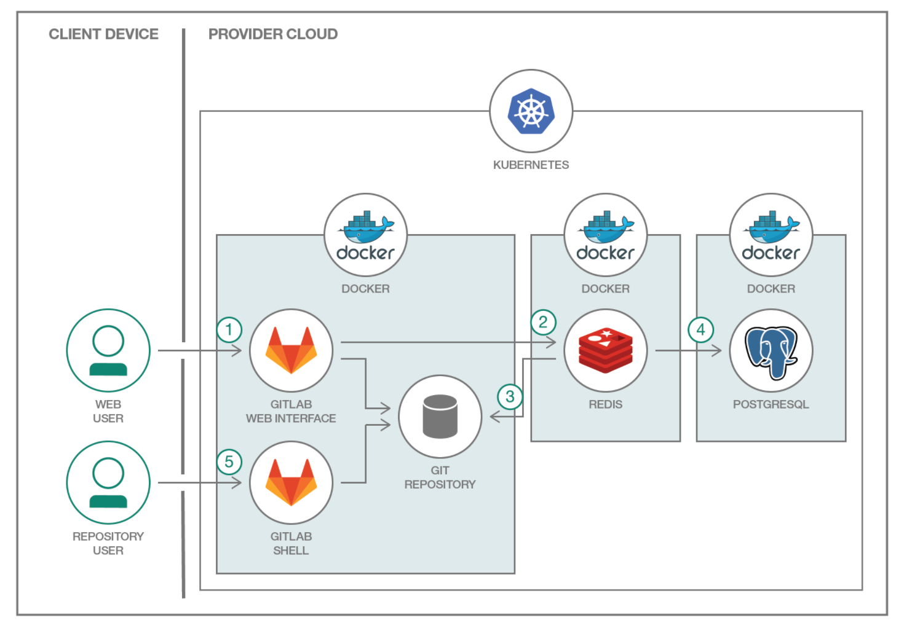

## gitlab

### gitlab 基本构成元素和执行流程

gitlab 基本构成元素如下图所示：



gitlab 基本执行流程：

1. The user interacts with GitLab via the web interface or by pushing code to a GitHub repository. The GitLab container runs the main Ruby on Rails application behind NGINX and gitlab-workhorse, which is a reverse proxy for large HTTP requests like file downloads and Git push/pull. While serving repositories over HTTP/HTTPS, GitLab utilizes the GitLab API to resolve authorization and access and serves Git objects.
2. After authentication and authorization, the GitLab Rails application puts the incoming jobs, job information, and metadata on the Redis job queue that acts as a non-persistent database.
3. Repositories are created in a local file system.
4. The user creates users, roles, merge requests, groups, and more—all are then stored in PostgreSQL.
5. The user accesses the repository by going through the Git shell.

结论：

1. 搭建 gitlab 集群需要三个容器，分别运行 Ruby on Rails 应用，Redis 和 PostgreSQL
2. 运行 Ruby on Rails 应用的容器还需要 nginx 和 gitlab-workhorse 的支持
3. Redis 和 PostgreSQL 都需要提供持久化的支持
4. 运行 Ruby on Rails 应用的容器需要在集群外部访问，所以需要 NodePort 类型的服务
5. 运行 Ruby on Rails 应用的容器提供 web 和 ssh 的访问方式，所以相应的服务需要提供两个端口

### gitlab 集群架构


架构说明：

* gitlab 服务的类型为 NodePort，运行集群外部的客户端访问。该服务提供两个两组端口，分别用于访问 web 和 ssh 。
* gitlab 服务后端对应的 Deployment 控制的 pod 运行  Ruby on Rails 应用，对这些容器提供持久化支持
* redis 服务对应与 redis pod，这些 redis pod 也由 Deployment 控制。对 redis 容器也提供持久化处理
* postgresql 服务对应与 postgresql pod，这些 postgresql pod 也由 Deployment 控制。对 postgresql 容器也提供持久化处理

### 问题

* github 怎样和 gitlab 交互？
* 相关容器为什么选择 Deployment，而不选择 StatefulSet ？
* Ruby on Rails 应用是怎样读取 redis 服务 和 postgresql 服务的相关信息的？
* gitlab/gitlab-ce 镜像的 Dockerfile 文件显示需要挂载 "/etc/gitlab", "/var/opt/gitlab", "/var/log/gitlab"，yaml 文件中只挂载了两个？


### 相关代码示例

部署 gitlab 服务和相应的 Deployment ：

```bash
---
apiVersion: v1
kind: Service
metadata:
  name: gitlab
  labels:
    app: gitlab
spec:
  ports:
    - name: gitlab-ui
      port: 80
      protocol: TCP
      targetPort: 30080
      nodePort: 30080
    - name: gitlab-ssh
      port: 22
      protocol: TCP
      targetPort: 22
      nodePort: 30022
  selector:
    app: gitlab
    tier: frontend
  type: NodePort
---
apiVersion: v1
kind: PersistentVolumeClaim
metadata:
  name: gitlab-claim
  labels:
    app: gitlab
spec:
  accessModes:
    - ReadWriteOnce
  resources:
    requests:
      storage: 10Gi
---
apiVersion: extensions/v1beta1
kind: Deployment
metadata:
  name: gitlab
  labels:
    app: gitlab
spec:
  strategy:
    type: Recreate
  template:
    metadata:
      labels:
        app: gitlab
        tier: frontend
    spec:
      containers:
        - image: gitlab/gitlab-ce:9.1.0-ce.0
          name: gitlab
          env:
            - name: GITLAB_OMNIBUS_CONFIG
              value: |
                postgresql['enable'] = false
                gitlab_rails['db_username'] = "gitlab"
                gitlab_rails['db_password'] = "gitlab"
                gitlab_rails['db_host'] = "postgresql"
                gitlab_rails['db_port'] = "5432"
                gitlab_rails['db_database'] = "gitlabhq_production"
                gitlab_rails['db_adapter'] = 'postgresql'
                gitlab_rails['db_encoding'] = 'utf8'
                redis['enable'] = false
                gitlab_rails['redis_host'] = 'redis'
                gitlab_rails['redis_port'] = '6379'
                gitlab_rails['gitlab_shell_ssh_port'] = 30022
                external_url 'http://gitlab.example.com:30080'
          ports:
            - containerPort: 30080
              name: gitlab
          volumeMounts:
            - name: gitlab
              mountPath: /var/opt/gitlab
              subPath: gitlab_data
            - name: gitlab
              mountPath: /etc/gitlab
              subPath: gitlab_configuration
      volumes:
        - name: gitlab
          persistentVolumeClaim:
            claimName: gitlab-claim

```

部署 redis 服务和相应的 Deployment ：

```bash
---
apiVersion: v1
kind: Service
metadata:
  name: redis
  labels:
    app: gitlab
spec:
  ports:
    - port: 6379
      targetPort: 6379
  selector:
    app: gitlab
    tier: backend
---
apiVersion: v1
kind: PersistentVolumeClaim
metadata:
  name: redis-claim
  labels:
    app: gitlab
spec:
  accessModes:
    - ReadWriteOnce
  resources:
    requests:
      storage: 10Gi
---
apiVersion: extensions/v1beta1
kind: Deployment
metadata:
  name: redis
  labels:
    app: gitlab
spec:
  strategy:
    type: Recreate
  template:
    metadata:
      labels:
        app: gitlab
        tier: backend
    spec:
      containers:
        - image: redis:3.0.7-alpine
          name: redis
          ports:
            - containerPort: 6379
              name: redis
          volumeMounts:
            - name: redis
              mountPath: /data
      volumes:
        - name: redis
          persistentVolumeClaim:
            claimName: redis-claim

```

部署 postgresql 服务和相应的 Deployment ：

```bash
---
apiVersion: v1
kind: Service
metadata:
  name: postgresql
  labels:
    app: gitlab
spec:
  ports:
    - port: 5432
  selector:
    app: gitlab
    tier: postgreSQL
---
apiVersion: v1
kind: PersistentVolumeClaim
metadata:
  name: postgres-claim
  labels:
    app: gitlab
spec:
  accessModes:
    - ReadWriteOnce
  resources:
    requests:
      storage: 10Gi
---
apiVersion: extensions/v1beta1
kind: Deployment
metadata:
  name: postgresql
  labels:
    app: gitlab
spec:
  strategy:
    type: Recreate
  template:
    metadata:
      labels:
        app: gitlab
        tier: postgreSQL
    spec:
      containers:
        - image: postgres:9.6.2-alpine
          name: postgresql
          env:
            - name: POSTGRES_USER
              value: gitlab
            - name: POSTGRES_DB
              value: gitlabhq_production
            - name: POSTGRES_PASSWORD
              value: gitlab
          ports:
            - containerPort: 5432
              name: postgresql
          volumeMounts:
            - name: postgresql
              mountPath: /var/lib/postgresql/data
      volumes:
        - name: postgresql
          persistentVolumeClaim:
            claimName: postgres-claim

```

[参考](https://github.com/IBM/Kubernetes-container-service-GitLab-sample)
